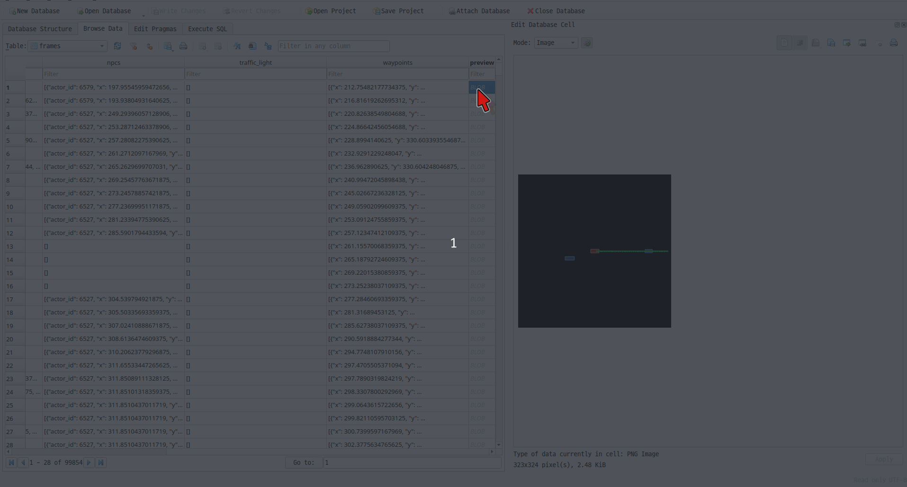
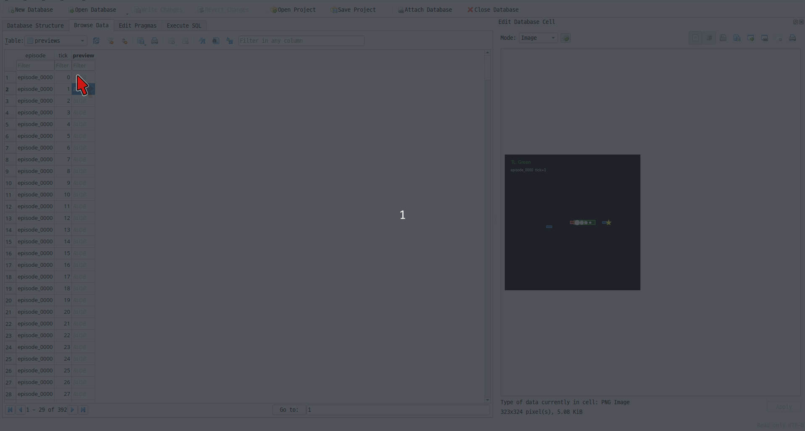
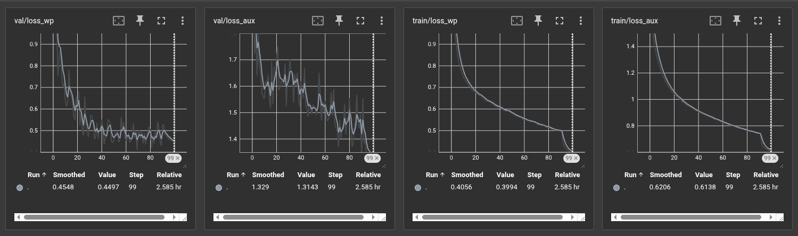

# reproducing-PlanT

A reproduction of the PlanT paper.

- **Paper:** Renz et al., "PlanT: Explainable Planning Transformers via Object-level Representations," [arXiv:2210.14222](https://arxiv.org/pdf/2210.14222), 2022
- **Original repository:**: https://github.com/autonomousvision/plant

Please note that this repository makes **no** academic contribution.
The architecture and design are almost identical to the original, with only minor clarifications.
The contribution of this repository is limited to the following:

- A **Dev Container** that bundles the entire environment, CARLA server included, so the whole setup reproduces from a single `devcontainer.json`.
- A reworked data pipeline that stores frames in a **SQLite DB**, one record per frame with a BEV visualization image in a BLOB field, so the dataset can be queried with SQL and inspected by eye instead of read as raw JSON.

Finally, the reproduction process is written up as a series of blog posts (in Korean) [here](https://i-am-wonseoklee.github.io/docs/reproducing-papers/00-plan-t/).

## Host Prerequisites

| Requirement | Notes |
|---|---|
| [Docker Engine](https://docs.docker.com/engine/install/) | Tested on Ubuntu 24.04 |
| [NVIDIA Container Toolkit](https://docs.nvidia.com/datacenter/cloud-native/container-toolkit/install-guide.html) | GPU pass-through for both PyTorch and CARLA |
| [VS Code](https://code.visualstudio.com/) + [Dev Containers extension](https://marketplace.visualstudio.com/items?itemName=ms-vscode-remote.remote-containers) | |

## Quickstart

**1. Allow containers to access your X display** (run once per session):

```bash
xhost +local:docker
```

**2. Open the repo in VS Code and reopen in container:**

```
Ctrl+Shift+P → "Dev Containers: Reopen in Container"
```

VS Code will build the `workspace` container.
This may take several minutes on the first run.


## Usage

### 1. Collect training data

> If you would rather skip collection and use an already-collected dataset, see [Pre-collected Data](#pre-collected-data).

This step needs the CARLA server, so start it first:

```
Ctrl+Shift+P → "Tasks: Run Task" → "Start CARLA"
```

Drive CARLA with autopilot and save observations to disk:

```bash
python3 scripts/collect.py          \
    --config configs/collector.yaml \  # CARLA connection and spawn settings
    --output data/frames.db         \  # output SQLite DB path
    --episodes 10                   \  # number of episodes to collect
    --ticks 2000                       # ticks per episode
```

Stop CARLA once collection finishes (steps 2 and 3 do not need it):

```
Ctrl+Shift+P → "Tasks: Run Task" → "Stop CARLA"
```

### 2. Train

> If you would rather skip training and use already-trained weights, see [Pre-trained Weights](#pre-trained-weights).

```bash
python3 scripts/train.py                \
    --model-config configs/plant.yaml   \ # model architecture (d_model, n_layers, …)
    --train-config configs/train.yaml   \ # training loop (lr, batch_size, epochs, …)
    --data data/frames.db               \ # path to collected frames DB
    --run-name my_run                     # (optional) subdirectory under log/ckpt dirs
```

### 3. Evaluate offline

> If you just want to see how the model performs, see [Evaluation Results](#evaluation-results).

```bash
python3 scripts/evaluate.py             \
    --checkpoint checkpoints/best.ckpt  \ # trained checkpoint (model config is embedded)
    --data data/frames.db               \ # path to frames DB
    --out data/eval.db                  \ # (optional) output DB for metrics and BEV images
    --episode episode_0001                # (optional) render a single episode only
```

### 4. Run closed-loop simulation

This step needs the CARLA server, so start it first:

```
Ctrl+Shift+P → "Tasks: Run Task" → "Start CARLA"
```

Drive CARLA with the trained model.
A BEV visualizer window opens on your host display:

```bash
# not yet implemented
# python3 scripts/simulate.py --checkpoint checkpoints/best.ckpt
```

Stop CARLA when you are done:

```
Ctrl+Shift+P → "Tasks: Run Task" → "Stop CARLA"
```

## Pre-collected Data

If you would rather not run collection yourself, you can download a pre-collected dataset here:

- Pre-collected database: [Download link](https://drive.google.com/file/d/1zmVvZBVXjMDZYPh-R8vFOykEbtUbpgOT/view?usp=drive_link) (~1.5 GB)

It holds about 100k frames over 500 episodes (~200 frames each), collected across `Town01`-`Town05` with 100 NPC vehicles per episode.
The simulation runs at 20 FPS and every 10th tick is saved, so frames are spaced 0.5 s apart (see [`configs/collector.yaml`](configs/collector.yaml)).
Each frame records the ego state, surrounding vehicles within 30 m, the traffic-light state, the route waypoints, and a BEV preview image.

The collection script from step 1 produces a database with the same schema and format.
Only the contents differ, since each run uses a different random seed.

The original PlanT dataset is a pile of JSON files, one per frame, thousands of them filling a directory.
Open one and you get a dense block of numbers with no sense of whether the scene is a lane change, a stop at a red light, or just driving straight.
Understanding what the training data looks like matters as much as understanding the model, and raw JSON makes that almost impossible to do by eye.

So this repository reworks the pipeline to store each frame as a single record in a **SQLite DB**, with a BEV rendering of the scene saved alongside it in a BLOB field.
You can now pull any subset of the data with a line of SQL, and scroll through the images in a DB browser such as `sqlitebrowser` to actually see what was collected.

|  |
|:--:|
| <em>Figure 1. Frames stored in the SQLite DB. Red bbox: ego vehicle, blue bboxes: obstacles (vehicles), green line: waypoints, green/red circles: traffic lights.</em> |

|  |
|:--:|
| <em>Figure 2. The same frames in training-dataset form, taken from a [smoke-test run](tests/test_dataset_smoke.py). Red bbox: ego vehicle, blue bboxes: obstacles (vehicles), green boxes: routes, yellow stars: target points, white circles: labeled waypoints.</em> |

## Pre-trained Weights

If you would rather skip training, you can download checkpoints trained on the [pre-collected dataset](#pre-collected-data):

- Best checkpoint (lowest validation loss): [Download link](https://drive.google.com/file/d/1RX8FhCdKQXjdpEnzjNFG7PVEsd0Oha4_/view?usp=drive_link) (~305 MB)
- Last checkpoint (final epoch): [Download link](https://drive.google.com/file/d/1UImf3de228KnW8d81vJd2SRfQ29TVYKm/view?usp=drive_link) (~305 MB)

These weights are the MEDIUM model (`d_model` 512, 8 layers, 8 heads), trained for 100 epochs with AdamW (`lr` 1e-4, batch size 32, decayed 10x at epoch 92) on the settings in [`configs/plant.yaml`](configs/plant.yaml) and [`configs/train.yaml`](configs/train.yaml).
The last two episodes are held out for validation.
Training took about 2.6 hours and converged to a validation waypoint L1 of ~0.45 m (`val/loss_wp`) and an auxiliary loss of ~1.31 (`val/loss_aux`); the sharp drop near the end is the learning-rate decay.

|  |
|:--:|
| <em>Figure 3. TensorBoard curves over 100 epochs. Left to right: validation waypoint loss, validation auxiliary loss, training waypoint loss, training auxiliary loss.</em> |

## Evaluation Results

The goal of this repository is to reproduce the paper, not to chase peak performance.
No effort was spent on tuning, longer schedules, or any trick to squeeze out better numbers, so the results below should be read as a sanity check that the pipeline learns, not as a benchmark.

Evaluated with the best checkpoint on the two held-out validation episodes (391 samples):

| Metric                                | Value  |
|---------------------------------------|--------|
| ADE (average over 4 waypoints)        | 0.76 m |
| FDE (final waypoint)                  | 1.23 m |
| Step 1 L2 (0.5 s)                     | 0.34 m |
| Step 2 L2 (1.0 s)                     | 0.60 m |
| Step 3 L2 (1.5 s)                     | 0.88 m |
| Step 4 L2 (2.0 s)                     | 1.23 m |
| Validation waypoint L1 (`loss_wp`)    | 0.41   |
| Validation auxiliary CE (`loss_aux`)  | 1.44   |

The error grows smoothly with the prediction horizon, which is the expected behavior: short-term prediction is accurate and uncertainty accumulates further out.

These numbers were almost certainly not the model's ceiling.
Looking at the training curves in Figure 3, the training losses were still descending at epoch 100, the validation auxiliary loss was still trending down, and every curve dropped again right after the learning-rate decay at epoch 92.
None of that looks fully converged, so a longer schedule (or a second decay step) would likely have improved these figures.
Pushing that further was simply out of scope here.
